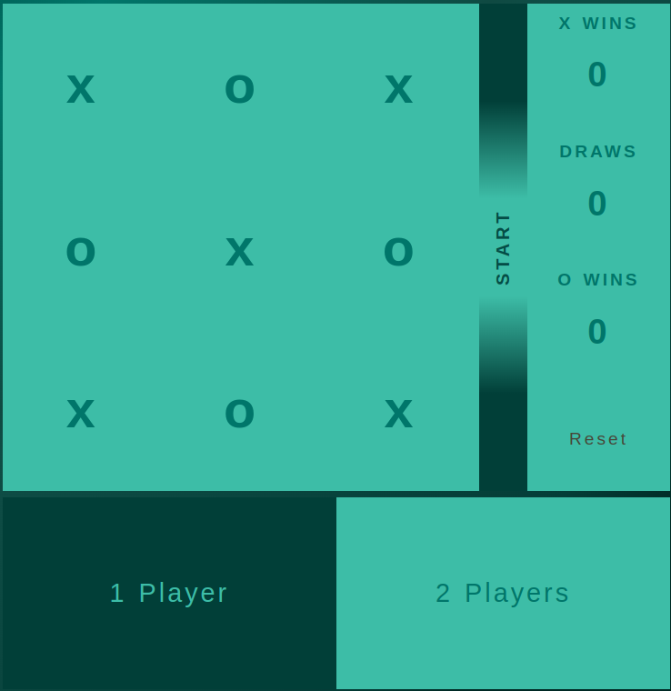
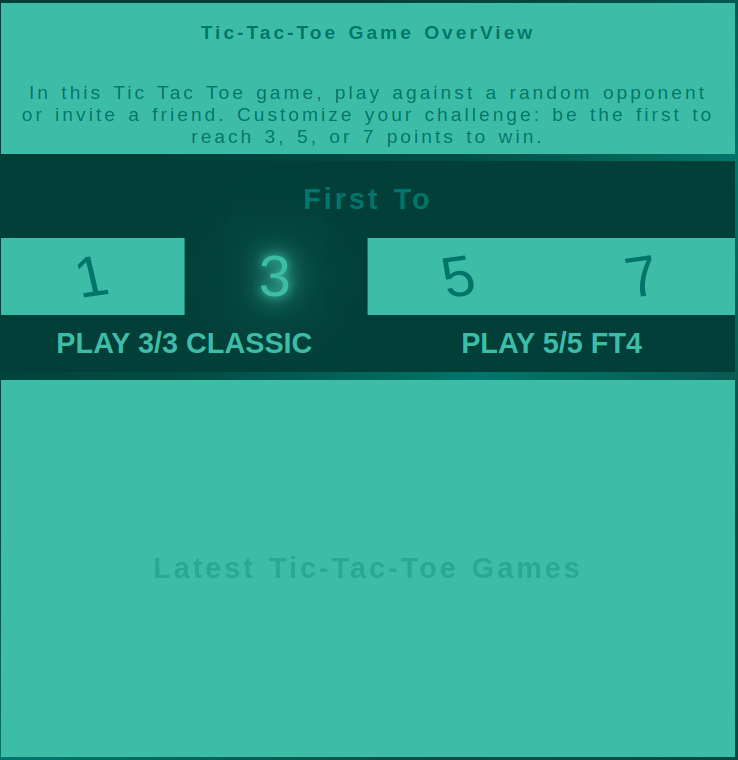

Welcome To my TicTacToe Game

After clonning the repo :
- cd tripleT
-  daphne -b 0.0.0.0 -p 8000 tripleT.asgi:application
-  browse : http://localhost:8000

Right side is the local game 

You can play against a Bot player, or 2 players Mode.

Left side is the remote game

Open two tabs and select the same game mode,
First to 1,3,5,7 is the number of wins needed to win
Classic mode is the 3/3 grid
FT4     mode is the 5/5 grid

